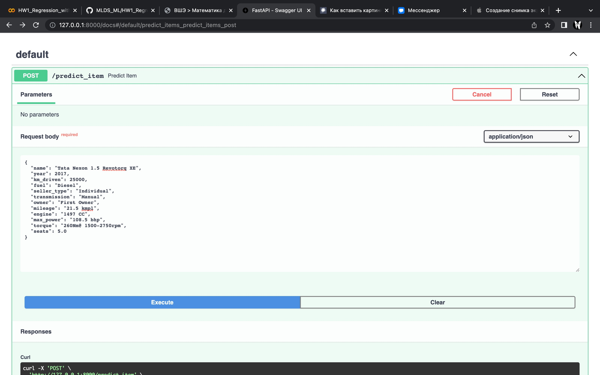

# Домашнее задание 1

В результате выполнения домашней работы было проделано следующее:
1. Произведена предообработка данных, где:
    - Удалены дублирующие строки у обучающего датасета.
    - Cтолбец torque разделен на два torque и max_torque_rpm.
    - Обработаны колонки, являющиеся числовыми признаками (единицы измерения используются в СИ, из значений убраны единицы измерения).
    - Пропуски были только у числовых признаков, которые были заполнены медианой.
2. Произведен разведочный анализ данных, где было выявлено (вся визуализация в .ipynb):
    - Что чем больше год, тем машина будет стоить дороже. Однако при этом могут встречаться новые машины по невысокой цене.
    - Чем меньше проехала машина по км, тем выше ее стоимость.
    - Зависимость цены от расхода топлива, от количество сидений и оборотов  - слабая.
    - Чем больше объем двигателя, тем больше стоимость машины.
    - Чем больше л.с., тем дороже стоит машина.
    - Чем больше крутящий момент, тем больше стоимость машины.
    - Сильная линейная зависимость наблюдается между selling_price и max_power. А также есть корреляция между: max_power, engine, torque. Наблюдается зависимость между engine и seats.
    - Меньше всего скоррелированы year и engine.
    - Чем больше у машины было владелецев, тем ниже ее стоимость.
    - Газомоторный транспорт дешевле транспорта на бензине и дизеле.
3. Обучение только на вещественных признаков моделей:
    - Лучший результат при Lasso-регрессии достигался при alpha = 1, при этом  на тесте r2_score = 0.6002993916743924 и MSE = 229759323371.61664
    - Лучший результат при ElasticNet-регрессии достигался при alpha = 0.6 и l1_ratio=0.8, при этом  на тесте r2_score = 0.5731003869251055 и MSE = 245394087986.45236.
    - Модели обученные только на вещественных признаках дают небольшую точность в предсказаниях, небольше 0.6
4. Обучение модели еще с учетом категориальных признаков:
    - Лучший результат при Ridge-регрессии достигался при alpha = 1, при этом  на тесте r2_score = 0.6330777029391952 и MSE = 210917414051.0027.
5. Был проведен feature engineering и проанализированы разные способы улучшения модели, наиболее лучшие результы дало следующее:
    - Вытащить из имени машины, ее бренд (повысило качество лучше всего).
    - Убрать из данных выбросы по колонке max_power (те, у которых значение равно 0).
    - Использование квадрата года.
    - Сделать логарифмирование столбцов engine и max_torque_rpm.
    - Добавить столбец произведение числа "лошадей" на литр объема.
    - Лучший результат при Ridge-регрессии достигался при alpha = 0.7, при этом  на тесте r2_score = 0.7910054848489787 и MSE = 120136015280.61855.
6. Была реализована бизнес метрика, в результате который можно сказать, что либо мало данных для обучения либо линейная регрессия не справляется с поставленной задачей. При этом на тесте business_score = 0.302.
7. Был реализован FastAPI сервис, который с точки зрения пользователя реализует две функции:
    - На вход в формате json подаются признаки одного объекта, на выходе сервис выдает предсказанную стоимость машины.
    - На вход подается csv-файл с признаками тестовых объектов, на выходе получаем файл с +1 столбцом - предсказаниями на этих объектах.

Скриншоты:

